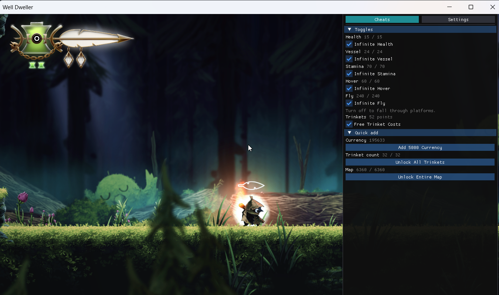

# Well Dweller Menu (Mod & Cheats)



A small menu for the Windows Steam version of Well Dweller. Press Insert or ~ while the game window is in front. The menu sits on the right.

It is meant for playing on hard without the stops: health, stamina, hover, bubble fly, the vessel throw, shop currency, trinket equip costs, all trinkets, and map fog.

## Cheats

- **Infinite Health.** Health stays at your current maximum. The maximum is not raised.
- **Infinite Stamina.** Stamina stays full. The meter drains toward its limit, so full is 0. The limit is not changed, and the unlimited-stamina unlock is not turned on.
- **Infinite Hover.** The mid-air hover meter stays full. It drains toward 40, so full is 0. The hover unlock is not turned on.
- **Infinite Fly.** Turns the bubble-fly state on and off. While it is on you do not need a bubble. Turn it off to fall through platforms. A keyboard hotkey for it can be set in Settings. The up-fly unlock is not turned on.
- **Infinite Vessel.** The flaming vessel meter stays full.
- **Free Trinket Costs.** Trinkets you have already found cost 0 points to equip. You still find them yourself. Turn it off to get the normal costs back.
- **Add 5000 Currency.** Adds 5000 of the white-diamond shop currency.
- **Unlock All Trinkets.** Asks you to confirm. Unlocks every missing trinket. Trinkets you already upgraded stay at that level.
- **Unlock Entire Map.** Asks you to confirm. Open the map first. Fogged rooms are marked explored, and rooms you have already explored stay as they are. Save in the game if you want it to stay after you leave.

Toggles are saved in `well-mod/config.json`, next to `WellDweller.exe`. That file appears the first time you change a toggle. It is local and is not part of this repo.

It does not raise your maximum health. Free Trinket Costs does not find trinkets for you. Unlock All Trinkets does, and it asks first.

## Install

Close the game. Put these files in the folder that contains `WellDweller.exe`:

```
version.dll
mods\Native\AurieCore.dll
mods\Aurie\YYToolkit.dll
mods\Aurie\WellDwellerMenu.dll
```

Start the game from Steam. Press Insert or ~.

`version.dll` and `WellDwellerMenu.dll` come from this project. Aurie and YYToolkit are separate. The menu needs YYToolkit 5, the preview that loads as `YYTK_ZeusMain`.

- Aurie: https://github.com/AurieFramework/Aurie
- YYToolkit: https://github.com/AurieFramework/YYToolkit

A game update can replace `WellDweller.exe`. These files stay next to it, so there is no patch to run again. If the menu never appears, `version.dll` is not in the same folder as `WellDweller.exe`.

## Uninstall

Close the game. Delete `version.dll`, `mods\Native\AurieCore.dll`, `mods\Aurie\YYToolkit.dll`, and `mods\Aurie\WellDwellerMenu.dll`.

## Build

This folder is meant to live as `well-mod` next to `WellDweller.exe`. Visual Studio 2022, toolset v143, Release | x64.

- `WellDwellerMenu.vcxproj` builds `mods\Aurie\WellDwellerMenu.dll`
- `loader\version.vcxproj` builds `version.dll` next to the exe

Close the game before building. The game locks those DLLs while it is running.

## License

MIT. The download also includes Aurie and YYToolkit, which are AGPL-3.0. See `THIRD_PARTY_NOTICES.md`.
